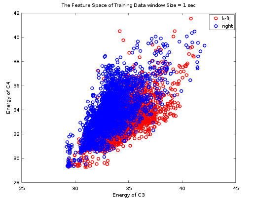

# [Motor Imagery for Brain-Computer Interface (BCI)](https://drive.google.com/file/d/1M8WLJuRAp7iPqaUfFI3_yNTL50aOy2lx/view)

Real-time classification of motor imagery EEG signal using BCI competition II Dataset III to classify right & left-hand movement signals using matlab. 

## Preprocessing

* The Frequency response of the FIR bandpass filter (7 Hz - 15 Hz) using windowing method.

* Applying a Bandpass FIR filter on a window of the signal to extract the µ band

* Frequency Domain of the signal before and after filtration

## Feature Extraction and selection

* For each window of the signal the energy of C3 and C4 channels is calculated using following
equation

$$Es = \sum_{n=0}^{N-1} s(n)^2$$

* Feature Space of the training data using different window length

|                     |                    |
|---------------------|--------------------|
|  | |
|  | |

## Classification

* KNN classifier is used for classification with different values of K. 

## Evaluation Criteria 

* Mutual Information (MI) and error rate (ERR)

$$MI = \frac{1}{2}log(1+SNR)$$ 

$$SNR = \frac{\sigma_{signal}^2}{\sigma_{noise}^2}$$

## Results

|KNN  | Max MI | Min Error \% | Max Accuracy %  |
|--------|--------|--------|--------|
|$$K = 1$$ | $$0.64654$$ | $$11.429$$ | $$88.571$$|
|$$K = 3$$ | $$0.82787$$ | $$8.5714$$| $$91.429$$|
|$$K = 5$$ | $$0.81647$$ | $$10$$| $$90$$|
|$$K = 7$$ | $$0.89775$$ | $$8.5714$$ | $$91.429$$|
|$$K = 9$$ | $$0.82190$$ | $$9.2857$$ | $$90.714$$|
|$$\mathbf{K = 11}$$| $$\mathbf{0.98919}$$ | $$\mathbf{7.8571}$$ |$$\mathbf{92.143}$$|
|$$K = 13$$| $$0.78632$$ | $$10.714$$  | $$89.286$$|
|$$K = 15$$| $$0.89809$$ | $$8.5714$$ | $$91.429$$|
